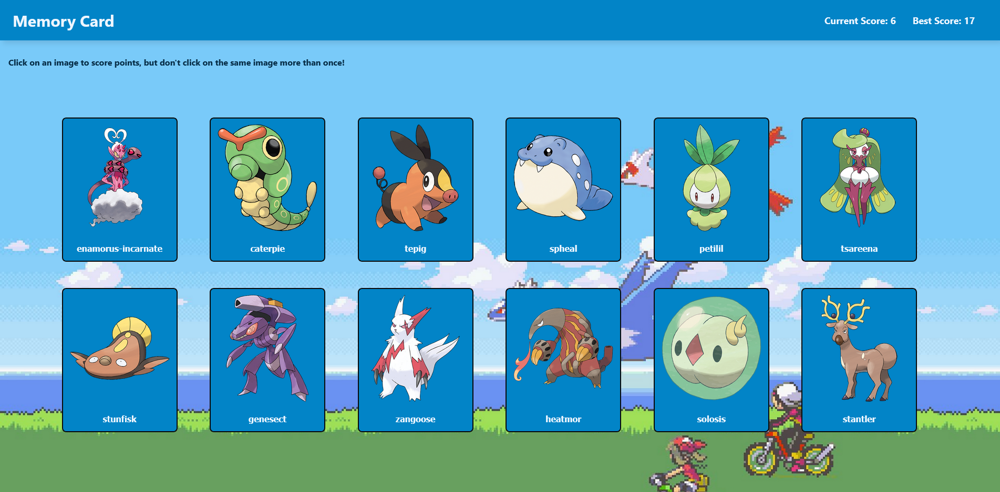

# Pokemon Memory Card Game

This website is a memory card game that makes use of a Pokemon API, made with React for me to learn about how to utilize the useEffect hook. It is part of my React learning journey, being also part of the The Odin Project online curriculum.

This site works by fetching some Pokemons from the API, and the user can click on their cards to score points, but if they click on the same Pokemon twice, their score is reset. There are 12 Pokemon on the screen at a time, but if the user manages to click at all of them, 12 other Pokemons will be loaded, and the user can continue scoring, as to improve their overall high score.

The layout of the site is pretty simple overall, with most of my effort having been spent in understanding how to work with React. At first I had a bit of trouble understanding how to make the game logic work properly, but once I understood it, everything went smoothly ever since. I thought it would take me longer to finish this project, but it was surprisingly quick.

Overall, a fun little project, and I'm definitively getting more familiar with how React works.